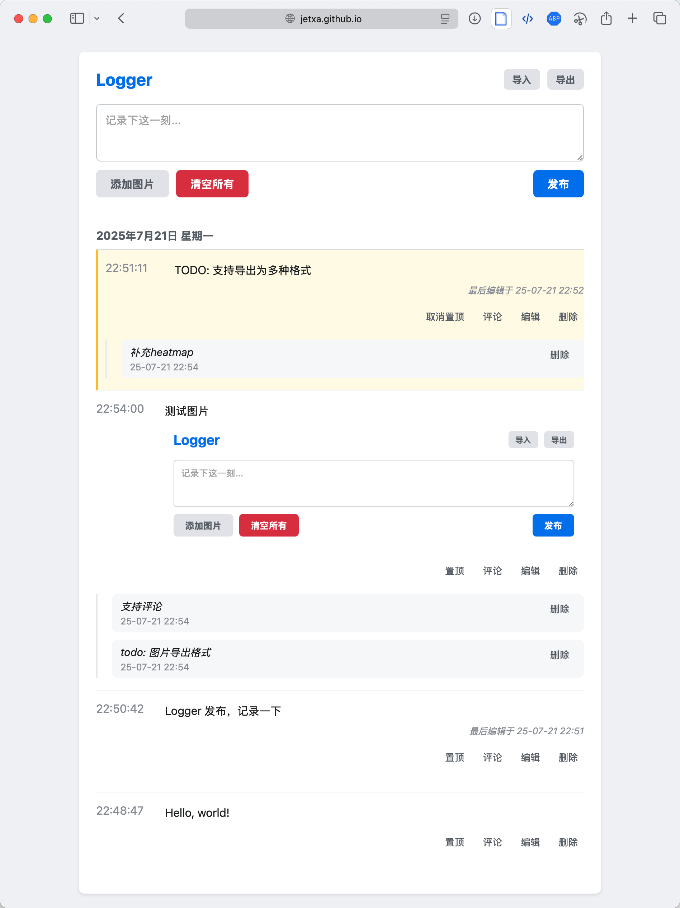

# Lsogger
个人本地版动态/日志/笔记记录工具，无联网，浏览器本地存储，类似于微博/朋友圈/Memos/Flomo笔记工具/Twitter等工具。

## 在线体验
[https://jetxa.github.io/logger/](https://jetxa.github.io/logger/)

数据存储在浏览器本地，如担心数据问题，可clone项目后，浏览器打开`index.html`文件体验使用。

**注意：由于数据存储在浏览器本地，如果清除浏览器缓存，会导致数据一并清除，自动备份功能开发中**

## 功能
- [x] 数据记录在浏览器本地，不联网
- [x] 支持文本、图片格式，截图后粘贴即可
- [x] 支持修改编辑
- [x] 支持评论
- [x] 支持数据导出到本地，以及从本地文件导入数据
- [x] 支持json格式输出导出（图片以base64编码）
- [ ] 支持数据自动导出备份，定期备份到本地
- [ ] 支持更多格式导出导入